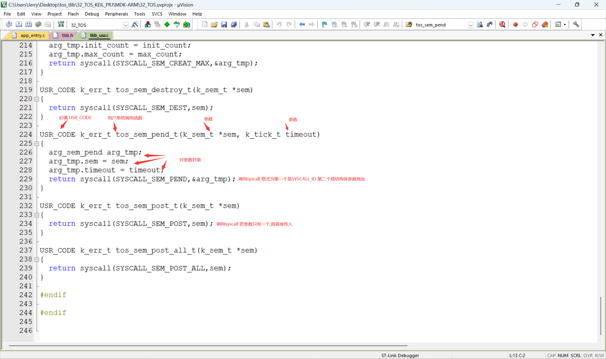

# TLIB开发细节

[TOC]

## KU_Memory_Layout


### 内核代码以及内核RO

- **地址范围**	
  - Base_Address :  0x08000000
  - Region_Size     :  0x00040000

- **存储数据类型**
  -  Kernel_Code  :  内核代码
  -  Kernel_RO      :  内核中的只读区域, 如 常量字符串

- **存储数据属性**
  -  Read-Only
  -  Only for Privileged Mode

### 内核全局变量RW和ZI

- **地址范围**
  -  Base_Address :  0x20000000
  -  Region_Size     :  0x00002000
- **存储数据类型**
  -  Kernel_RW       :  内核的全局变量 (已初始化的)
  -  Kernel_ZI          :  内核的全局变量 (未初始化的)
- **存储数据属性**
  -  Read-And-Write
  -  Only for Privileged Mode

### 用户代码以及用户RO

- **地址范围**
  -  Base_Address :  0x20002000
  -  Region_Size     :  0x00002000
- **存储数据类型**
  -  User_Code       :  用户代码
  -  User_RO           :  用户只读的全局变量，如字符串
- **存储数据属性**
  -  Read-Only
  -  Both for Un-Privileged Mode and Privileged Mode
- **用户自定义需注意**
  -  用户在添加用户函数时候，务必在函数定义前面添加 USER_CODE

### 用户全局变量

- **地址范围**
  -  Base_Address :  0x20004000
  -  Region_Size     :  0x0000C000
- **存储数据类型**
  -  User_Data       :  用户自定义的全局变量 [both 初始化 and 未初始化]
  -  Mem_Pool_In  : 内核自定义的内存池也在这个部分，作为堆区供用户使用
- **存储数据属性**
  -  Read-And-Write
  -  Both for Un-Privileged Mode and Privileged Mode
- **用户自定义需注意**
  -  用户在添加全局变量的时候，务必在全局变量的定义前面添加 USER_DATA

### 其他段

- **地址范围**
  -  Base_Address :  Unkown
  -  Region_Size     :  Unkown
- **存储数据类型**
  -  Unkown
- **存储数据属性**
  -  Unkown
- **注解**
  - 其他部分的数据即为IO映射的寄存器, 针对TLIB, 所有的 IO 访问层次 都应该通过系统调用访问
    -  **SYSCALL_IO_WRITE**   :   IO写
    -  **SYSCALL_IO_READ**     :   IO读
    -  **SYSCALL_IO_CTL**        :   IO配置
  - 对于不同的硬件，所需要配置的数据结构不同，写和读的数据结构也不同，但是都需要遵行TLIB规范：[TL_SPEC](#TL_SPEC) [Not Done Yet]

### KU_Memory_Layout实现

```assembly
; *************************************************************
; *** Scatter-Loading Description File generated by uVision ***
; *************************************************************

LR_IROM1 0x08000000 0x00040000  {    
  ; RO for kernel
  ER_IROM1 0x08000000 0x00040000  { 
   *.o (RESET, +First)
   *(InRoot$$Sections)
   .ANY (+RO)
  }
  ; RW and ZI for kernel
  RW_IRAM1 0x20000000 0x00002000  {  
   .ANY (+RW +ZI)
  }
  ; RO for User
  USER_CODE 0x20002000 0x00002000 {
   .ANY (MYRO)
  }
  ; RW and ZI for user and Default-Memory-Pool
  RW_IRAM2 0x20004000 0x0000C000{
	.ANY(RAM_AREA)
	.ANY(USDT)
	
  }
}

```

------

## 系统调用流程

### 用户调用TLIB库API

-  **在入口函数 `app_entry` 或者`其他用户线程` 中调用 [TLIB_API](./TLIB_SDK.md)  , 此处以API:`tos_sem_pend_t` 为例子** 
  -  **[TLIB_User_API 实现在 tlib_usr.c中]**
  - 

-  **进入 TLIB_Usr 库 , 进行入口参数包装, 调用 syscall 函数** 

  - **`tos_sem_pend_t` API 定义:**

  - 

  - **函数syscall声明:**

    - ```c
      k_err_t syscall(int SYSCALL,void * parameter);
      ```

  - **函数syscall定义:**

    - ```assembly
          AREA MYRO, CODE, READONLY, ALIGN=2
          THUMB
          REQUIRE8
          PRESERVE8
      		
          GLOBAL syscall
      syscall
          SVC		#0xf  
      	BX      LR
      	END
      ```

  - **注解:  此处借助ARM编译器的函数调用规则 [AACPS](https://blog.csdn.net/zhoutaopower/article/details/114343143)) , 将 宏定义的SYSCALL_ID 和 传入参数void* parameter 分别放于寄存器R0 , R1 中 , 并在 syscall 中触发 SVC 异常**

### SVC_Handler详细解说

- **SVC_Handler:**

  - ```assembly
    GLOBAL SVC_Handler
    	IMPORT cpu_tlib_kernel_stk_init
    	IMPORT syscall_kernel_knl
    ; R0 调用号 R1 结构体地址
    ; R0 返回值
    SVC_Handler
     	; R0 - R3,R12,LR,PC,xPSR 从右往左依次入栈 [PSP] [硬件自动完成]
     	; 同时当前模式切换为 Handler 模式 切换栈为MSP
        CPSID   I
    	MRS		R3,PSP      		; 由于R3 已经保存, 用来替代做暂时的PSP
    	
    ;下面这一段是判断是否存在浮点数寄存器并保存到 PSP 栈中 
    ;----------------------------------------------------------------------------
        IF {FPU} != "SoftVFP"
        ; is it extended frame?
        TST     LR, #0x10
        IT      EQ
        VSTMDBEQ  R3!, {S16 - S31}
        ; S0 - S16, FPSCR saved automatically here
        ; save EXC_RETURN
        STMFD   R3!, {LR}
        ENDIF
    ;-------------------------------------------------------------------------------
    	
    	
    	SUBS    R3, R3, #0x20				;为R4 - R11 预留空间
    	STM     R3, {R4 - R11}				;将R4 - R11 依次存放于栈中  (R11 - R4 依次入栈)
        LDR     R2, =k_curr_task			;获取当前任务的tcb指针 k_curr_task的地址
        LDR     R2, [R2]					;根据k_curr_task的地址获取当前任务tcb的地址
    	LDR		R4, [R2,#0x4]				;加载task结构体的k_sp,判断是否是用户线程
    	CBZ		R4, KTD						;为 0 则为内核线程, 否则为用户线程
    	B UTD
    ;KTD 为内核线程进行系统调用的操作
    ;由于内核线程并没有用户栈
    ;所以内核线程进行系统调用是非抢占式的
    ;用户线程进行系统调用在内核态是抢占式的
    ;--------------------------------------------------------------------------------
    KTD
    	STR     R3, [R2]					;将最新的栈顶PSP,他的值也就是R3存放回到task的sp中
    	PUSH {LR}							
    	BL syscall_kernel_knl				;调用syscall_kernel_knl 函数
    										;传入参数不用变，任然在R0,R1中
    	;此时R0 为 syscallid , R1 为传入的参数void* parameter
    	
    	POP  {LR}
    	;下面这段就是恢复寄存器的值了 和下面UTD部分一致
    	LDR     R1, =k_curr_task
    	LDR		R1, [R1]
    	LDR     R1, [R1]
    	STR     R0, [R1,#0x20]
    	
    	LDR     R1, =k_curr_task
        LDR     R2, =k_next_task
        LDR     R3, [R2]
        STR     R3, [R1]
        LDR     R1, [R3]
    	
        LDM     R1, {R4 - R11}
        ADDS    R1, R1, #0x20
    	
    	IF {FPU} != "SoftVFP"
        ; restore EXC_RETURN
        LDMFD   R1!, {LR}
        ; is it extended frame?
        TST     LR, #0x10
        IT      EQ
        VLDMIAEQ    R1!, {S16 - S31}
        ENDIF
    		
        MSR     PSP, R1
    	STR 	R0,[R1]
    	ORR     LR, LR, #0x04   ;标定非Handler模式使用PSP
        CPSIE   I
        BX      LR
    ;-------------------------------------------------------------------------------------
    
    
    ;UTD 为用户线程进行系统调用的操作
    ;-------------------------------------------------------------------------------------
    UTD
    	STR		R3, [R2]					;将最新的栈顶PSP,他的值也就是R3存放回到sp中
    
    ;下面这段是去引发状态切换的信号,就是把task的stat_swtch_pending变量置1
    ;-------------------------------------------------------------------------------------
    	LDR		R3, =0x1					
    	STRB	R3, [R2,#0x9]
    ;-------------------------------------------------------------------------------------
    
    ;下面这段是调用cpu_tlib_kernel_stk_init函数
    ;这个函数初始化内核栈,方便下次CPU捡起时知道状态 ，包括内核的入口,以及传入的参数，寄存器的值等
    ;且每次SVC 调用时都需要调用一次
    ;-------------------------------------------------------------------------------------
    	PUSH	{LR}
    	; cpu_tlib_kernel_stk_init 本来是有两个变量
    	; 参数分别是 int syscallid 和 void* parameter,k_task_t* task
    	; 由于前面根本没动过传过来的R0 和 R1
    	; 且此时R2 也是当前任务控制块TCB的地址  无需再传入其他参数
    	BL		cpu_tlib_kernel_stk_init
    	POP		{LR}
    ;-------------------------------------------------------------------------------------
    
    
    ;下面这段是引发一个软件中断
    ;方便完成SVC后立马进入进程切换
    ;-------------------------------------------------------------------------------------
    	PUSH    {LR}
    	BL		port_context_switch
    	POP		{LR}
    ;-------------------------------------------------------------------------------------
    	
    
    	LDR     R1, =k_curr_task				;获取当前任务的tcb指针 k_curr_task的地址
    	LDR		R1, [R1]						;根据k_curr_task的地址获取当前任务tcb的地址
    	LDR     R1, [R1]						;加载tcb中的 sp
    
        LDM     R1, {R4 - R11}					;恢复R4 -R11
        ADDS    R1, R1, #0x20
    
    ;下面这段是恢复浮点数寄存器
    ;-------------------------------------------------------------------------------------
    	IF {FPU} != "SoftVFP"
        ; restore EXC_RETURN
        LDMFD   R1!, {LR}
        ; is it extended frame?
        TST     LR, #0x10
        IT      EQ
        VLDMIAEQ    R1!, {S16 - S31}
        ENDIF
    ;-------------------------------------------------------------------------------------
     
        MSR     PSP, R1							;往PSP写入新的栈顶
    	ORR     LR, LR, #0x04					;标定返回之后使用PSP
    	
        CPSIE   I
    
    	BX LR									;返回
    	;在返回的瞬间由于已经引发了软件中断
    	;会立马进入PendSV_Handler
        ALIGN
    ;-------------------------------------------------------------------------------------
    ```

  - **task结构体:**

  - ```c
    struct k_task_st {
        k_stack_t          *sp;  							//用户栈顶指针sp 
    #if TOS_CFG_TLIB_EN >0u && TOS_CFG_OBJ_DYNAMIC_CREATE_EN >0u
        k_stack_t 		   *k_sp;							//内核栈指针k_sp,在内核线程中始终为0
        uint8_t			 	in_kernel;					    //是否在内核态, 1为是, 0为否，在内核线程中始终为0
        uint8_t			 	stat_swtch_pending;				//内核态用户态切换的信号,置1则下次由CPU捡起时进行切换
        pid_t			 	pid;							//线程pid		
    #endif
        knl_obj_t        	knl_obj;               
        char             	name[K_TASK_NAME_MAX];  
        k_task_entry_t   	entry;                 
        void               *arg;                    
        k_task_state_t   	state;                 
        k_prio_t         	prio;                 
        k_stack_t          *stk_base;              
    #if TOS_CFG_TLIB_EN >0u && TOS_CFG_OBJ_DYNAMIC_CREATE_EN >0u
        k_stack_t 		   *k_stk_base;						//内核栈基址		
        size_t			 	k_stk_size;						//内核栈大小
    #endif
        size_t              stk_size;             
    #if TOS_CFG_OBJ_DYNAMIC_CREATE_EN > 0u
        k_list_t            dead_list;              
    #endif
        k_list_t            stat_list;              
        k_tick_t            tick_expires;           
        k_list_t            tick_list;             
        k_list_t            pend_list;          
    #if TOS_CFG_MUTEX_EN > 0u
        k_list_t            mutex_own_list;         
        k_prio_t            prio_pending;           
    #endif
        pend_obj_t         *pending_obj;            
        pend_state_t        pend_state;             
    #if TOS_CFG_ROUND_ROBIN_EN > 0u
        k_timeslice_t       timeslice_reload;   
        k_timeslice_t       timeslice;          
    #endif
    
    #if (TOS_CFG_MESSAGE_QUEUE_EN > 0u) || (TOS_CFG_PRIORITY_MESSAGE_QUEUE_EN > 0u)
        void               *msg;                
    #endif
        
    #if (TOS_CFG_MAIL_QUEUE_EN > 0u) || (TOS_CFG_PRIORITY_MAIL_QUEUE_EN > 0u)
        void               *mail;              
        size_t              mail_size;
    #endif
        
    #if TOS_CFG_EVENT_EN > 0u
        k_opt_t             opt_event_pend;     
        k_event_flag_t      flag_expect;        
        k_event_flag_t     *flag_match;                                    
    #endif
    };
    ```

  - **cpu_tlib_kernel_stk_init 实现:**

  - ```c
    extern k_err_t syscall_kernel(int sysc_id,void* parameter);
    //用户线程进入SVC_Handler后会调用此函数对内核栈进行初始化
    //1. 作用1是传递参数
    //2, 作用2是规定好内核态的入口地址 和其他的寄存器状态
    __KNL__ void cpu_tlib_kernel_stk_init(int syscall,void* parameter,k_task_t* task)
    //入口参数已经传递过来 可以查阅上面的SVC_Handler
    {
    	cpu_data_t *sp;
        sp = (cpu_data_t *)((task->k_stk_base)+ task->k_stk_size);
        sp = (cpu_data_t *)((cpu_addr_t)sp & 0xFFFFFFF8);
    	
        /* auto-saved on exception(pendSV) by hardware */
        *--sp = (cpu_data_t)0x01000000u;    								/* xPSR     */
        *--sp = (cpu_data_t)syscall_kernel;        				  			/* entry    */
        //加载用户线程在内核态的入口 syscall_kernel
        *--sp = (cpu_data_t)tos_task_destroy_dyn;           				/* R14 (LR) */
        *--sp = (cpu_data_t)0x12121212u;    								/* R12      */
        *--sp = (cpu_data_t)0x03030303u;    								/* R3       */
        *--sp = (cpu_data_t)0x02020202u;   									/* R2       */
        
    	*--sp = (cpu_data_t)parameter;    								    /* R1: arg  */
        //R1 -> parameter
        *--sp = (cpu_data_t)syscall;            							/* R0: arg  */
        //R2 -> syscall_id
    	
    #if defined (TOS_CFG_CPU_ARM_FPU_EN) && (TOS_CFG_CPU_ARM_FPU_EN == 1U)
        *--sp = (cpu_data_t)0xFFFFFFFDL;
    #endif
    
        *--sp = (cpu_data_t)0x11111111u;    /* R11      */
        *--sp = (cpu_data_t)0x10101010u;    /* R10      */
        *--sp = (cpu_data_t)0x09090909u;    /* R9       */
        *--sp = (cpu_data_t)0x08080808u;    /* R8       */
        *--sp = (cpu_data_t)0x07070707u;    /* R7       */
        *--sp = (cpu_data_t)0x06060606u;    /* R6       */
        *--sp = (cpu_data_t)0x05050505u;    /* R5       */
        *--sp = (cpu_data_t)0x04040404u;    /* R4       */
    	task->k_sp = (k_stack_t *)sp;		//修改k_sp 为新的sp 方便下次CPU捡起时恢复
    }
    ```

### PendSV_Handler详细解说

- **PendSV_Handler**

  - ```assembly
    	GLOBAL PendSV_Handler
    
    PendSV_Handler
    ; R0 - R3,R12,LR,PC,xPSR 从右往左依次入栈 [PSP] [硬件自动完成]
    ; 同时当前模式切换为 Handler 模式 切换栈为MSP
        CPSID   I			
        MRS     R0, PSP			;这两句话是为了和port_sched_start 做配合
        						;内核启动时候会调用port_sched_start, 把PSP置0 同时引发一个软件中断
        						;第一次启动时是不需要保存最开始的初始化的执行流的，内核中也没有地方来保存
    	CBZ     R0, PendSVHandler_nosave 	;PSP为0就直接跳过保存上文的阶段
    	
    ;这一段是保存上文
    ;----------------------------------------------------------------------------
    _context_save
    
    ;下面这一段是判断是否存在浮点数寄存器并保存到 PSP 栈中 
    ;----------------------------------------------------------------------------
        IF {FPU} != "SoftVFP"
        ; is it extended frame?
        TST     LR, #0x10
        IT      EQ
        VSTMDBEQ  R0!, {S16 - S31}
        ; S0 - S16, FPSCR saved automatically here
    
        ; save EXC_RETURN
        STMFD   R0!, {LR}
        ENDIF
    ;----------------------------------------------------------------------------
        SUBS    R0, R0, #0x20				;给R4-R11留空间
        STM     R0, {R4 - R11}				;保存R4-R11
        LDR     R1, =k_curr_task			
        LDR     R1, [R1]					;获取R1为当前任务控制块的地址
    	LDR		R2, [R1,#0x4]				
    	CBZ		R2, KTD_SAVE				;查看k_sp是否为0,0则说明是内核线程
    										;内核线程使用KernelThread_SAVE
    	LDRB	R2, [R1,#0x8]				;查看in_kernel是否为1
    	CBZ		R2, UTD_USAVE				;in_kernel为0 则是UserThread_User_SAVE
    	B 		UTD_KSAVE					;否则是UserThread_Kernel_SAVE
    ;这里做区别主要是用户线程有内核态和用户态
    ;内核态会将新的栈顶PSP保存到k_sp 用户态会将新的栈顶PSP保存到sp中
    ;这也是为什么再SVC_Handler中不直接改in_kernel的状态，将其置1
    ;需要引入信号stat_swtch_pending的原因
    ;如果直接置1 这里就会判断前一刻是内核态 会把新的栈顶放到k_sp里 但实际上应该放到sp里
    UTD_USAVE
    KTD_SAVE
    	STR     R0, [R1]			;把新的栈顶放到sp中
    	B PendSVHandler_nosave 
    UTD_KSAVE
    	STR     R0, [R1,#0x4]		;把新的栈顶放到k_sp中
    PendSVHandler_nosave
        LDR     R0, =k_curr_task
        LDR     R1, =k_next_task
        LDR     R2, [R1]
        STR     R2, [R0]			;更新优先级最高的任务并将其控制块地址放于k_curr_task
        							;并在R2中驻留
    ;下面这段就是捡起下文了
    ;----------------------------------------------------------------------------
    	LDR		R0, [R2,#0x4]				
    	CBZ		R0, Load_Kernel_Thread	;查看是否是内核线程，是就跳转到Load_Kernel_Thread
    	B		Load_User_Thread		;不是则Load_User_Thread
    Load_Kernel_Thread
    	MRS 	R0, CONTROL				
    	BIC 	R0,R0,#0x1				;先规定好返回之后的状态为Privileged
    	LDR		R0,[R2]					;从sp中取出栈顶指针放到R0中
    	B 		Load					;加载
    Load_User_Thread					
    	LDRB	R0, [R2,#0x9]
    	CBZ		R0, UTD_KUJG			;检查是否存在state_switch 的信号 不存在就直接条阻焊
    Clear_SWtch_Pend					;存在信号
    	LDR		R0, =0x0
    	STRB	R0, [R2,#0x9]			;清理信号
    	LDRB	R0, [R2,#0x8]			;判断状态 
    	CBZ		R0,  LD_1				;反转in_kernel状态
    LD_0								;加载用户态,反转之前的内核态
    	LDR		R0, =0x0				
    	STRB	R0, [R2,#0x8]			;把in_kernel改为0
    	B UTD_KUJG						;加载
    	
    LD_1								;加载内核态，反转之前的用户态
    	LDR		R0, =0x1
    	STRB	R0, [R2,#0x8]			;把in_kernel改为1
    	B UTD_KUJG						;加载
    	
    UTD_KUJG
    	LDRB	R0, [R2,#0x8]			;查看in_kernel
    	CBZ		R0, Load_UTD_Usr		;加载用户态
    	B 		Load_UTD_Ker			;加载内核态
    Load_UTD_Ker
    	MRS		R0, CONTROL				
    	BIC 	R0,R0,#0x1				;规定好返回之后的状态为Privileged
    	MSR		CONTROL,R0
    	LDR		R0, [R2,#0x4]			；把R0置为k_sp
    	B Load							; 加载
    Load_UTD_Usr
    	MRS		R0, CONTROL
    	ORR		R0,R0,#0x1				
    	MSR		CONTROL,R0				;规定好返回之后的状态为Un-Privileged
    	LDR		R0, [R2]				; 把R0置为 sp
    	B Load							; 加载
    
    Load
        LDM     R0, {R4 - R11}			;恢复R4-R11
        ADDS    R0, R0, #0x20
        
    ;下面这段是恢复浮点数寄存器
    ;-------------------------------------------------------------------------------------
        IF {FPU} != "SoftVFP"
        ; restore EXC_RETURN
        LDMFD   R0!, {LR}
        ; is it extended frame?
        TST     LR, #0x10
        IT      EQ
        VLDMIAEQ    R0!, {S16 - S31}
        ENDIF
    ;-------------------------------------------------------------------------------------
        MSR     PSP, R0				;把新的PSP写回R0
        ORR     LR, LR, #0x04		;规定返回之后使用PSP
        CPSIE   I
        BX      LR
    ```

### syscall_kernel详细解说

- **经过SVC_Handler 和 PendSV_Handler后，再次捡起的执行流来到了内核态**

- **内核态入口函数**

  - ```c
    k_err_t syscall_kernel_knl(int sysc_id,void* parameter)
    ```

- **内核态参数**

  - ```c
    int sysc_id,void* parameter
    ```

- **syscall_kernel定义**

  - ```c
    void syscall_kernel(int sysc_id,void* parameter)
    {
    	k_err_t ret = K_ERR_KNL_NOT_RUNNING;
    	if(tos_knl_is_running())
    	{
    		switch(sysc_id)
    		{
                case ...:
                    ret = ...();
                break;
                
                case ...:
                    ret = ...();
                break;
                // 中间的case 太多 可以查阅tlib.c
                default:
                    ret = K_ERR_TLIB_INVALID_CALLID;
                break;
    		}
    	}
    	TOS_CPU_CPSR_ALLOC();
    	TOS_CPU_INT_DISABLE();
    	cpu_data_t *sp;
      sp = (cpu_data_t *)(k_curr_task->sp);     //得到用户态的sp
    #if defined (TOS_CFG_CPU_ARM_FPU_EN) && (TOS_CFG_CPU_ARM_FPU_EN == 1U)
      sp[9] = (cpu_data_t)ret;					//如果存在浮点数寄存器 往上数9个就是R0的位置
    #else
    	sp[8] = (cpu_data_t)ret;				//没有则数8个是R0的位置 
    #endif
        //上面是在修改用户态的R0 也就是返回值
    	k_curr_task->stat_swtch_pending =1; //触发内核态用户态切换信号
    	cpu_context_switch();   			//引发软件中断
    	TOS_CPU_INT_ENABLE();
    	while(1); //被切走
    
    ```

### syscall_kernel_knl详细解说

- **syscall_kernel_knl是内核线程进行系统调用调用的函数,与普通函数相差不大，此处给出定义:** 

  - ```c
    k_err_t syscall_kernel_knl(int sysc_id,void* parameter)
    {
    	k_err_t ret = K_ERR_KNL_NOT_RUNNING;
    	if(tos_knl_is_running())
    	{
    		switch(sysc_id)
    		{
                case ...:
                    ret = ...();
                break;
                    
                case ...:
                    ret = ...();
                break;
                    
    			default:
    				ret = K_ERR_TLIB_INVALID_CALLID;
    			break;
    	
    		}
    	}
    	return ret;
    }
    ```

## MPU硬件开发详解

## TL_SPEC

### 添加系统调用步骤

- **在`tlib.h`中添加系统调用号 宏定义, 要求格式为SYSCALL_XXX,且未被其他系统调用号注册**
  - 

- **在`tlib.h`中添加系统调用函数声明, 若库函数的传入参数 >=2 则需要为该系统调用定义参数结构体**
  - 
  - 

- **在`tlib_usr.c`中完成库函数定义**
  - 

- **在`tlib.c` 的`syscall_kernel_knl` 和 `syscall_kernel` 中 添加`case 条件` 并按照要求实现`syscall`**
  - 


### IO系统调用规范