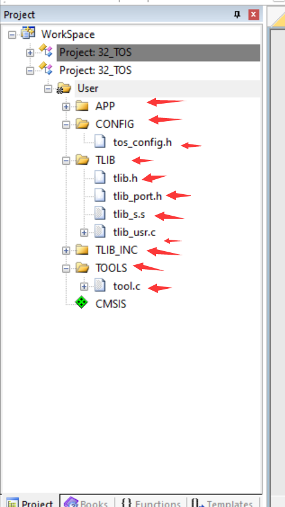
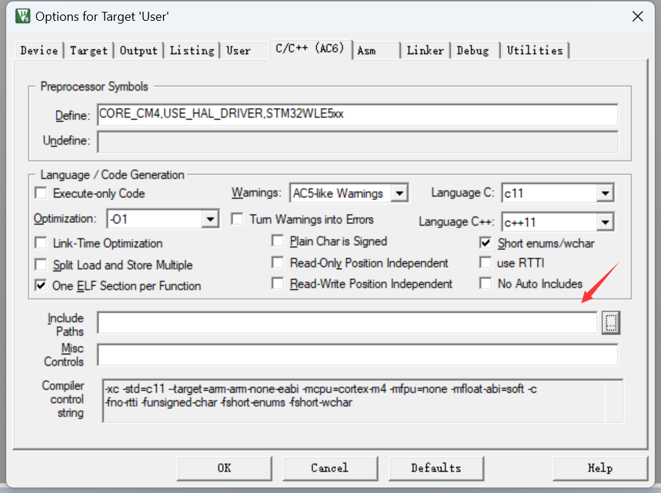
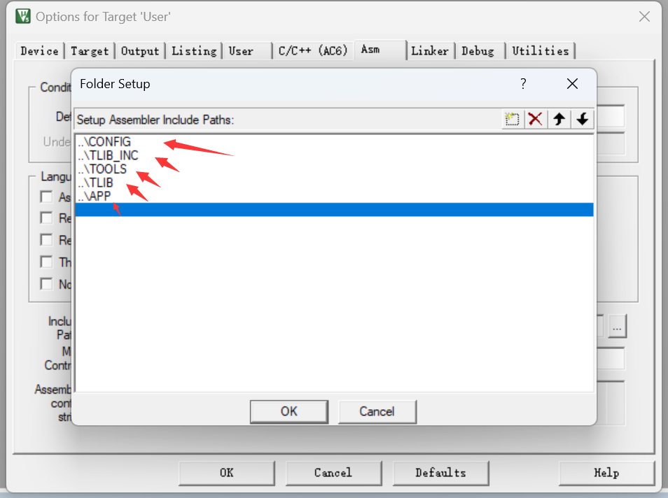
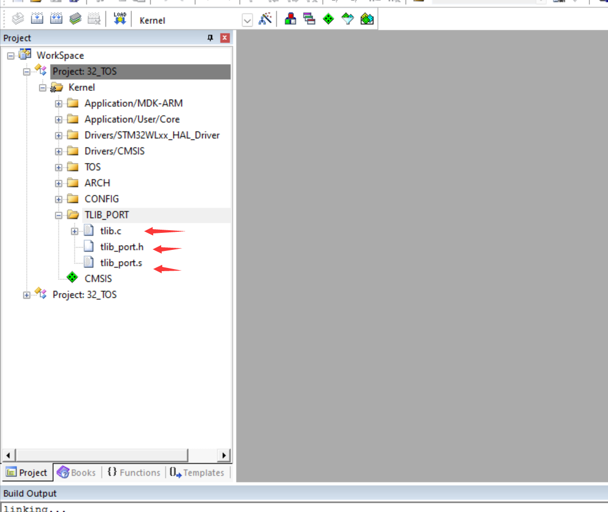

# `TOS_TLIB`用户使用指南

[TOC]

## `TOS_TLIB`概述

 `TOS_TLIB`旨在为`Tencent OS Tiny` 引入用户态和内核态，同时为用户态程序提供`安全的API`。`TLIB`通过引入用户态和内核态，将实现严格的隔离，使 `TOS` 在不同权限级别下运行不同的任务,为内核开发人员提供更加安全的开发环境。此外，为用户态程序提供`安全的API`将与原`TOS API` 高度相似，使得原来使用`TOS` 开发人员在不熟悉`TLIB`的情况下也能迅速进行开发。

综上,`TLIB`对于提升`TOS`的隔离性、安全性和开发友好性都具有重要意义。通过在 `Tencent Tiny OS` 中实现`TLIB`，将为广泛的`TOS`的嵌入式应用提供更加稳定和安全的基础。

## `TOS_TLIB`使用流程

### 引入`TLIB`静态库

- **建立`KEIL`工程**

- **创建下图的`GROUP`**
- 

- **添加各个组的.c 和 .h文件 , 与`TLIB` 中的文件一致**
- **点击魔术棒 , 添加头文件路径**
- 

- 添加下列目录

- 
- **`APP`工程编译烧录**
- **模板代码所使用的硬件板为`Tencent OS Tiny` 官方板 , 可以直接烧录**

### Kernel工程

- **正常引入`TOS_Kernel` 工程**
- **创建`TLIB_PORT` 包**
- **引入 `TLIB_PORT` 的各个文件**
- 
- **修改`ARCH/port_s.s` 中的  软中断 和 用于系统调用的中断 **
- **下列以 `ARM-Cortex-M4`为例子**
- **将`PendSV_Handler`替换**

```assembly
GLOBAL PendSV_Handler
PendSV_Handler
    CPSID   I
    MRS     R0, PSP
	CBZ     R0, PendSVHandler_nosave
	
_context_save
    ; R0-R3, R12, LR, PC, xPSR is saved automatically here
    IF {FPU} != "SoftVFP"
    ; is it extended frame?
    TST     LR, #0x10
    IT      EQ
    VSTMDBEQ  R0!, {S16 - S31}
    ; S0 - S16, FPSCR saved automatically here

    ; save EXC_RETURN
    STMFD   R0!, {LR}
    ENDIF
		
		
    SUBS    R0, R0, #0x20
    STM     R0, {R4 - R11}
    LDR     R1, =k_curr_task
    LDR     R1, [R1]
	LDR		R2, [R1,#0x4]
	CBZ		R2, KTD_SAVE
	LDRB	R2, [R1,#0x8]
	CBZ		R2, UTD_USAVE
	B 		UTD_KSAVE
UTD_USAVE
KTD_SAVE
	STR     R0, [R1]
	B PendSVHandler_nosave
UTD_KSAVE
	STR     R0, [R1,#0x4]
PendSVHandler_nosave
    LDR     R0, =k_curr_task
    LDR     R1, =k_next_task
    LDR     R2, [R1]
    STR     R2, [R0]

;;;TLIB START
	LDR		R0, [R2,#0x4]
	CBZ		R0, Load_Kernel_Thread
	B		Load_User_Thread
Load_Kernel_Thread
	MRS 	R0, CONTROL
	BIC 	R0,R0,#0x1
	LDR		R0,[R2]
	B 		Load
Load_User_Thread
	LDRB	R0, [R2,#0x9]
	CBZ		R0, UTD_KUJG
Clear_SWtch_Pend
	LDR		R0, =0x0
	STRB	R0, [R2,#0x9]
	LDRB	R0, [R2,#0x8]
	CBZ		R0,  LD_1
LD_0
	LDR		R0, =0x0
	STRB	R0, [R2,#0x8]
	B UTD_KUJG
LD_1
	LDR		R0, =0x1
	STRB	R0, [R2,#0x8]
	B UTD_KUJG
UTD_KUJG
	LDRB	R0, [R2,#0x8]
	CBZ		R0, Load_UTD_Usr
	B 		Load_UTD_Ker
Load_UTD_Ker
	MRS		R0, CONTROL
	BIC 	R0,R0,#0x1
	MSR		CONTROL,R0
	LDR		R0, [R2,#0x4]
	B Load
Load_UTD_Usr
	MRS		R0, CONTROL
	ORR		R0,R0,#0x1
	MSR		CONTROL,R0
	LDR		R0, [R2]
	B Load

Load
    LDM     R0, {R4 - R11}
    ADDS    R0, R0, #0x20

    IF {FPU} != "SoftVFP"
    ; restore EXC_RETURN
    LDMFD   R0!, {LR}
    ; is it extended frame?
    TST     LR, #0x10
    IT      EQ
    VLDMIAEQ    R0!, {S16 - S31}
    ENDIF

    MSR     PSP, R0
    ORR     LR, LR, #0x04
    CPSIE   I
    BX      LR
```

- **更多细节解释在 [TLIB 开发细节](./TLIB_DETAIL.md)**
- **将 `SVC_Handler` 替换**

```assembly
GLOBAL SVC_Handler
	IMPORT cpu_tlib_kernel_stk_init
	IMPORT syscall_kernel_knl
; must use psp for user msp for kernel 
; or will  destory
; R0 调用号 R1 结构体地址
; R0 返回值
SVC_Handler
    CPSID   I
	; judge for Handler_Mode
	MOV		R3,LR
	LDR  	R2,=0xFFFFFFF1
	SUB		R3,R3,R2
	CBZ		R3,CAL_FRM_HANDLER
	MOV		R3,LR
	LDR  	R2,=0xFFFFFFE1
	SUB		R3,R3,R2
	CBZ		R3,CAL_FRM_HANDLER
	
	MRS		R3,PSP
	
	; R0-R3, R12, LR, PC, xPSR is saved automatically here
    IF {FPU} != "SoftVFP"
    ; is it extended frame?
    TST     LR, #0x10
    IT      EQ
    VSTMDBEQ  R3!, {S16 - S31}
    ; S0 - S16, FPSCR saved automatically here

    ; save EXC_RETURN
    STMFD   R3!, {LR}
    ENDIF
	
	
	SUBS    R3, R3, #0x20
	STM     R3, {R4 - R11}
    LDR     R2, =k_curr_task
    LDR     R2, [R2]
    
	;;;TLIB START
	LDR		R4, [R2,#0x4]
	CBZ		R4, KTD
	B UTD
CAL_FRM_HANDLER
	CPSIE	I
	PUSH    {LR}
	BL      syscall_kernel_knl
	POP     {LR}
	
	MRS 	R1,MSP
	STR     R0, [R1]
	
	BX 		LR
KTD
	STR     R3, [R2]
	PUSH {LR}
	BL syscall_kernel_knl
	POP  {LR}
	LDR     R1, =k_curr_task
	LDR		R1, [R1]
	LDR     R1, [R1]
	STR     R0, [R1,#0x20]
	
	LDR     R1, =k_curr_task
    LDR     R2, =k_next_task
    LDR     R3, [R2]
    STR     R3, [R1]
    LDR     R1, [R3]
	
    LDM     R1, {R4 - R11}
    ADDS    R1, R1, #0x20
	
	IF {FPU} != "SoftVFP"
    ; restore EXC_RETURN
    LDMFD   R1!, {LR}
    ; is it extended frame?
    TST     LR, #0x10
    IT      EQ
    VLDMIAEQ    R1!, {S16 - S31}
    ENDIF
		
    MSR     PSP, R1
	STR 	R0,[R1]
	ORR     LR, LR, #0x04
    CPSIE   I
    BX      LR
UTD
	STR		R3, [R2]
	LDR		R3, =0x1
	STRB	R3, [R2,#0x9]
	
	PUSH	{LR}
	BL		cpu_tlib_kernel_stk_init
	POP		{LR}
    
	PUSH    {LR}
	BL		port_context_switch
	POP		{LR}
	
	
	LDR     R1, =k_curr_task
	LDR		R1, [R1]
	LDR     R1, [R1]
	
    LDM     R1, {R4 - R11}
    ADDS    R1, R1, #0x20
	
	IF {FPU} != "SoftVFP"
    ; restore EXC_RETURN
    LDMFD   R1!, {LR}
    ; is it extended frame?
    TST     LR, #0x10
    IT      EQ
    VLDMIAEQ    R1!, {S16 - S31}
    ENDIF
		
    MSR     PSP, R1
	ORR     LR, LR, #0x04
	
    CPSIE   I

	BX LR
    ALIGN
    END
```

- **更多细节解释在 [TLIB 开发细节](./TLIB_DETAIL.md)**
- **使能`tos_config.h`中的 `TOS_CFG_TLIB_EN`**
- **Kernel工程的main函数替换如下**

```c
int main(void)
{
	extern void User_Init(void);
	User_Init();
    
    /******* this is User_Defined function *******/
  	BSP_Init();
    /********************************************/ 
    
    /******* this is User_Defined function *******/
	MPU_Config();
    /********************************************/  
    
    
	k_err_t err;
	err = tos_knl_init();
	if(err != K_ERR_NONE)
    {
        /******* this is User_Defined function *******/
        	err_handle();
        /********************************************/ 
    }
	err = tos_task_create(&app_entry_tcb,								
                          "app_entry",										
                          (k_task_entry_t)0x20003001,			
                          NULL,														
                          APP_PRIO_ENTRY,									
                          app_stack,											
                          APP_STACK_ENTRY_SIZE,
                          0);
	if(err != K_ERR_NONE)
	{
        /******* this is User_Defined function *******/
        	err_handle();
        /********************************************/ 
    }
	err = tos_knl_start();
    
/******* this is User_Defined function *******/
    err_handle();
/********************************************/ 
	
    while(1);

}
```


- **编译烧录Kernel工程**
- **Kernel 工程只需要烧录一次**
- **`APP` 工程每次`APP`代码改变时都需要烧录**

## `APP`工程入口状态描述

- **入口函数**
  - 入口函数为 `app_entry`
  - `void app_entry(void *)` 
- **入口状态**
  - 入口函数为内核线程 处于 `Privileged` 状态
  - 可以利用`TLIB_API` 创建 **内核线程** or  **用户线程**
  - 内核线程级别更高, 用户线程级别较低

## `TOS_TLIB`用户须知

**`APP`工程与Kernel工程相互隔离 , 但是在以下的文件中应该保持同步**

- **`tlib_port.h`**
- **`API`的各个头文件  如: `tos_task.h` , `tos_slist.h` , `tos_mutex.h` 等**
- **配置文件`tos_config.h` (请保持 `TOS_CFG_MMHEAP_DEFAULT_POOL_EN` 为0) **
- **[ 若需要使用堆 请自行利用`tos_mmheap API`进行管理 ]**
- **保持同步的方法**
  -  **工程文件ADD 同一个文件**
  -  **文件复制粘贴**
- **最好不要创建内核线程， 如果需要创建内核线程，需要像对待`ISR`程序一样 **  