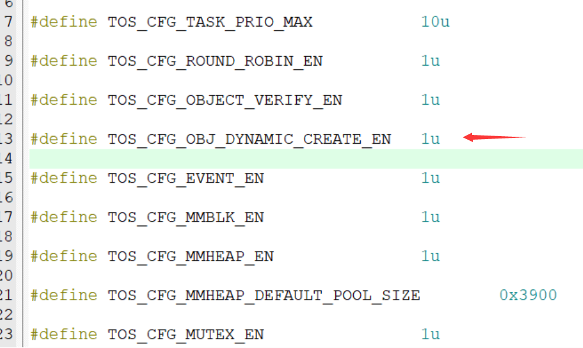
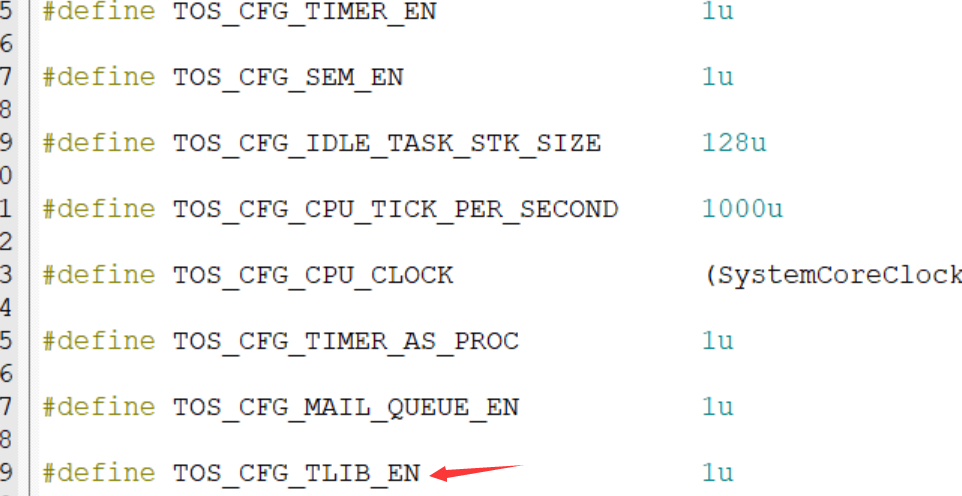

# `TOS_TLIB`用户使用指南

[TOC]

## `TOS_TLIB`概述

 `TOS_TLIB`旨在为`Tencent OS Tiny` 引入用户态和内核态，同时为用户态程序提供`安全的API`。`TLIB`通过引入用户态和内核态，将实现严格的隔离，使 `TOS` 在不同权限级别下运行不同的任务,为内核开发人员提供更加安全的开发环境。此外，为用户态程序提供`安全的API`将与原`TOS API` 高度相似，使得原来使用`TOS` 开发人员在不熟悉`TLIB`的情况下也能迅速进行开发。

综上,`TLIB`对于提升`TOS`的隔离性、安全性和开发友好性都具有重要意义。通过在 `Tencent Tiny OS` 中实现`TLIB`，将为广泛的`TOS`的嵌入式应用提供更加稳定和安全的基础。

## `TOS_TLIB`使用流程

### `TLIB`启用

- 在 `tos_config.h` 文件中将 `TOS_CFG_OBJ_DYNAMIC_CREATE_EN` 宏使能



- 在 `tos_config.h` 文件中将 `TOS_CFG_TLIB_EN` 宏使能



- ( 这一条是依赖于具体的硬件架构代码部分 以 `cortex-m4` 内核为例子)  将 `port_S.s` 中的`PendSV Handler`改为如下

```assembly
    GLOBAL PendSV_Handler
PendSV_Handler
    CPSID   I
    MRS     R0, PSP
	CBZ     R0, PendSVHandler_nosave
	
_context_save
    ; R0-R3, R12, LR, PC, xPSR is saved automatically here
    IF {FPU} != "SoftVFP"
    ; is it extended frame?
    TST     LR, #0x10
    IT      EQ
    VSTMDBEQ  R0!, {S16 - S31}
    ; S0 - S16, FPSCR saved automatically here

    ; save EXC_RETURN
    STMFD   R0!, {LR}
    ENDIF
		
		
    SUBS    R0, R0, #0x20
    STM     R0, {R4 - R11}
    LDR     R1, =k_curr_task
    LDR     R1, [R1]
	LDR		R2, [R1,#0x4]
	CBZ		R2, KTD_SAVE
	LDRB	R2, [R1,#0x8]
	CBZ		R2, UTD_USAVE
	B 		UTD_KSAVE
UTD_USAVE
KTD_SAVE
	STR     R0, [R1]
	B PendSVHandler_nosave
UTD_KSAVE
	STR     R0, [R1,#0x4]
PendSVHandler_nosave
    LDR     R0, =k_curr_task
    LDR     R1, =k_next_task
    LDR     R2, [R1]
    STR     R2, [R0]

;;;TLIB START
	LDR		R0, [R2,#0x4]
	CBZ		R0, Load_Kernel_Thread
	B		Load_User_Thread
Load_Kernel_Thread
	MRS 	R0, CONTROL
	BIC 	R0,R0,#0x1
	LDR		R0,[R2]
	B 		Load
Load_User_Thread
	LDRB	R0, [R2,#0x9]
	CBZ		R0, UTD_KUJG
Clear_SWtch_Pend
	LDR		R0, =0x0
	STRB	R0, [R2,#0x9]
	LDRB	R0, [R2,#0x8]
	CBZ		R0,  LD_1
LD_0
	LDR		R0, =0x0
	STRB	R0, [R2,#0x8]
	B UTD_KUJG
LD_1
	LDR		R0, =0x1
	STRB	R0, [R2,#0x8]
	B UTD_KUJG
UTD_KUJG
	LDRB	R0, [R2,#0x8]
	CBZ		R0, Load_UTD_Usr
	B 		Load_UTD_Ker
Load_UTD_Ker
	MRS		R0, CONTROL
	BIC 	R0,R0,#0x1
	MSR		CONTROL,R0
	LDR		R0, [R2,#0x4]
	B Load
Load_UTD_Usr
	MRS		R0, CONTROL
	ORR		R0,R0,#0x1
	MSR		CONTROL,R0
	LDR		R0, [R2]
	B Load

Load
    LDM     R0, {R4 - R11}
    ADDS    R0, R0, #0x20

    IF {FPU} != "SoftVFP"
    ; restore EXC_RETURN
    LDMFD   R0!, {LR}
    ; is it extended frame?
    TST     LR, #0x10
    IT      EQ
    VLDMIAEQ    R0!, {S16 - S31}
    ENDIF

    MSR     PSP, R0
    ORR     LR, LR, #0x04
    CPSIE   I
    BX      LR
```

详细解说可查阅[`TLIB`开发细节](./TLIB_DETAIL.md)

- ( 这一条是依赖于具体的硬件架构代码部分 以 `cortex-m4` 内核为例子)  将 `port_S.s` 中添加`SVC_Handler` 并注释掉原有的`SVC_Handler`改为如下

```assembly
GLOBAL SVC_Handler
	IMPORT cpu_tlib_kernel_stk_init
	IMPORT syscall_kernel_knl
; must use psp for user msp for kernel 
; or will  destory
; R0 调用号 R1 结构体地址
; R0 返回值
SVC_Handler
    CPSID   I
	MRS		R3,PSP
	
	; R0-R3, R12, LR, PC, xPSR is saved automatically here
    IF {FPU} != "SoftVFP"
    ; is it extended frame?
    TST     LR, #0x10
    IT      EQ
    VSTMDBEQ  R3!, {S16 - S31}
    ; S0 - S16, FPSCR saved automatically here

    ; save EXC_RETURN
    STMFD   R3!, {LR}
    ENDIF
	
	
	SUBS    R3, R3, #0x20
	STM     R3, {R4 - R11}
    LDR     R2, =k_curr_task
    LDR     R2, [R2]
    
	;;;TLIB START
	LDR		R4, [R2,#0x4]
	CBZ		R4, KTD
	B UTD
KTD
	STR     R3, [R2]
	PUSH {LR}
	BL syscall_kernel_knl
	POP  {LR}
	LDR     R1, =k_curr_task
	LDR		R1, [R1]
	LDR     R1, [R1]
	STR     R0, [R1,#0x20]
	
	LDR     R1, =k_curr_task
    LDR     R2, =k_next_task
    LDR     R3, [R2]
    STR     R3, [R1]
    LDR     R1, [R3]
	
    LDM     R1, {R4 - R11}
    ADDS    R1, R1, #0x20
	
	IF {FPU} != "SoftVFP"
    ; restore EXC_RETURN
    LDMFD   R1!, {LR}
    ; is it extended frame?
    TST     LR, #0x10
    IT      EQ
    VLDMIAEQ    R1!, {S16 - S31}
    ENDIF
		
    MSR     PSP, R1
	STR 	R0,[R1]
	ORR     LR, LR, #0x04
    CPSIE   I
    BX      LR
UTD
	STR		R3, [R2]
	LDR		R3, =0x1
	STRB	R3, [R2,#0x9]
	
	PUSH	{LR}
	BL		cpu_tlib_kernel_stk_init
	POP		{LR}
    
	PUSH    {LR}
	BL		port_context_switch
	POP		{LR}
	
	
	LDR     R1, =k_curr_task
	LDR		R1, [R1]
	LDR     R1, [R1]
	
    LDM     R1, {R4 - R11}
    ADDS    R1, R1, #0x20
	
	IF {FPU} != "SoftVFP"
    ; restore EXC_RETURN
    LDMFD   R1!, {LR}
    ; is it extended frame?
    TST     LR, #0x10
    IT      EQ
    VLDMIAEQ    R1!, {S16 - S31}
    ENDIF
		
    MSR     PSP, R1
	ORR     LR, LR, #0x04
	
    CPSIE   I

	BX LR
    ALIGN
    END
```

详细解说可查阅[`TLIB`开发细节](./TLIB_DETAIL.md)

- 接下来是在main中调用`tos_knl_init`完成初始化,同时创建第一个`app线程` 同时开启内核  ( 使用`tlib`的线程创建方式!!!!)

- 在引入`tlib`后 ， 内核线程分为了两种线程 , `内核线程` 以及 `用户线程`, 使用 `TOS API` 创建的线程为内核线程， 使用 `TLIB API` 创建的线程为用户线程 , 内核线程会长期处于 特权级别 操作并不安全 不建议用户创建 用户线程则处于 普通级别 较安全
- 建议`main` 函数方式

```c
int main(void)
{
	k_err_t err;
	err = tos_knl_init();
	if(err != K_ERR_NONE)
		while(1);
	pid_t pid = (pid_t)-1;
    // tos_task_create_dyn_tlib 并非用户API 而是内核态的API
	err = tos_task_create_dyn_tlib("app_entry",   			\    //线程名字
                                    app_entry,				\	 //线程入口
                                    NULL,					\	 //传入参数
                                    APP_PRIO_ENTRY,			\	 //线程优先级
                                    APP_STACK_ENTRY_SIZE,	\	 //线程用户栈大小
                                    KERNEL_STACK_SIZE,		\	 //线程内核栈大小
                                    0,						\	 //时间轮转使用的tick数
                                    &pid);						 //成功创建将PID 放入参数pid中	
	if(err != K_ERR_NONE)
		while(1);	
	err = tos_knl_start();
	while(1);
}
```

- 用户程序函数例子

  ```c
  
  #include "tlib.h"  // 包含用户态API
  
  void app_entry(void * parameter )
  {
  		while(1)
  		{
  			pid_t pid = get_pid(); //用户态API调用案例
  			
  		}
  }
  ```

- 在`app_entry`中使用用户`API` 进行开发 详情: [用户`API`手册](./TLIB_SDK.md)